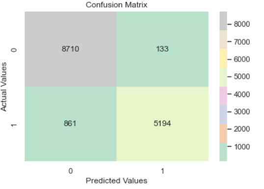

# Customer churn prediction
Final project for Final project for Data Analytics course (ITC C506) carried out at José Rizal University. The code has been made available as a reference if anyone would like to reproduce the results of this project.

```Please cite this  project if this repository is useful for your research.```

## Project Overview
### Business Understanding
* Customer churn prediction for SMARTER company
* The dataset is based on the activity of the subscribers' from last month.
* THe dataset is approximately 50,000 rows long and 58 columns wide

Objective:

- Understand why customer is leaving (‘churning’) the company and build a predictive model to analyze who most likely leave in the future.
- Characteristics of those customers who churned and who did not churn.
- Whether customers’ months in service has any impact on churn.
- Whether churn amount was different at certain revenue levels.
- Whether those that churned that had higher levels of dropped or blocked calls.

## Getting Started :seedling:
To get the local copy of thi repository, please run the following commands on your terminal:
```https://github.com/PizaaRiaaa/customer-churn-prediction.git```

* dataset: [.xlsx](dataset/ChurnData.xlsx)
* notebook: [.ipynb](ChurnAnalysis.ipynb)
* fullpaper: [.pdf](fullpaper/CRISP-DM-ChurnAnalysis.pdf)

## Results :palm_tree:
|Score   | Model                  |
|--------|------------------------|
|0.933682| Decision Tree          | 
|0.709021| Support Vector Machine |  
|0.705128| Naive Bayes            |
|0.689019| K-Nearest Neighbor     |    
|0.674184| Logistic Regression    |    

from the above table the Decision Tree model is the best model as it has the accuracy score of ```93%```

### measure accuracy of the classifier
```Accuracy score: 93.33```
```Precision: 97.50```
```Recall: 85.78```
```F1 score: 91.27```

### Confusion Matrix


_Interpretation:_
* TN: eight thousand seven hundred ten (8710) customers did not churn that are correctly predicted
* TP: five thousand one hundred ninety-four (5194) customers churned that are correctly predicted
* FN: eight hundred sixty-one (861) customers churned, but predicted that they will not churn
* FP: one hundred thirty-three (133) customers did not churn but predicted that they will churn

## License
This project is [MIT](LICENSE) Licensed

